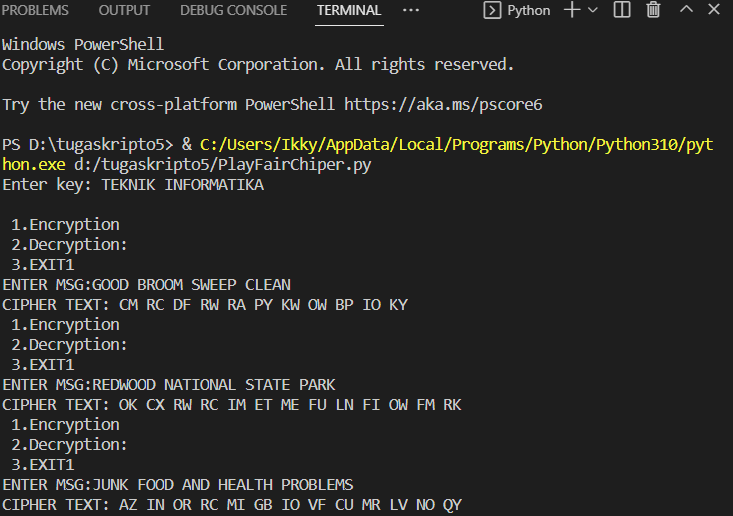

# TUGAS KRIPTO
# PERTEMUAN 6

| Nama | RISKY HARIADI |
| ----- | -------|
| NIM     | 312010124      |
| Kelas   | TI.20.A.1        |
| Mata Kuliah | Kriptografi |

# Latihan :

## *Lakukan enkripsi Playfair Cihper pada plaintext:*

GOOD BROOM SWEEP CLEAN

REDWOOD NATIONAL STATE PARK

JUNK FOOD AND HEALTH PROBLEMS

Dengan kunci **“TEKNIK INFORMATIKA”**

# Ini Hasilnya

